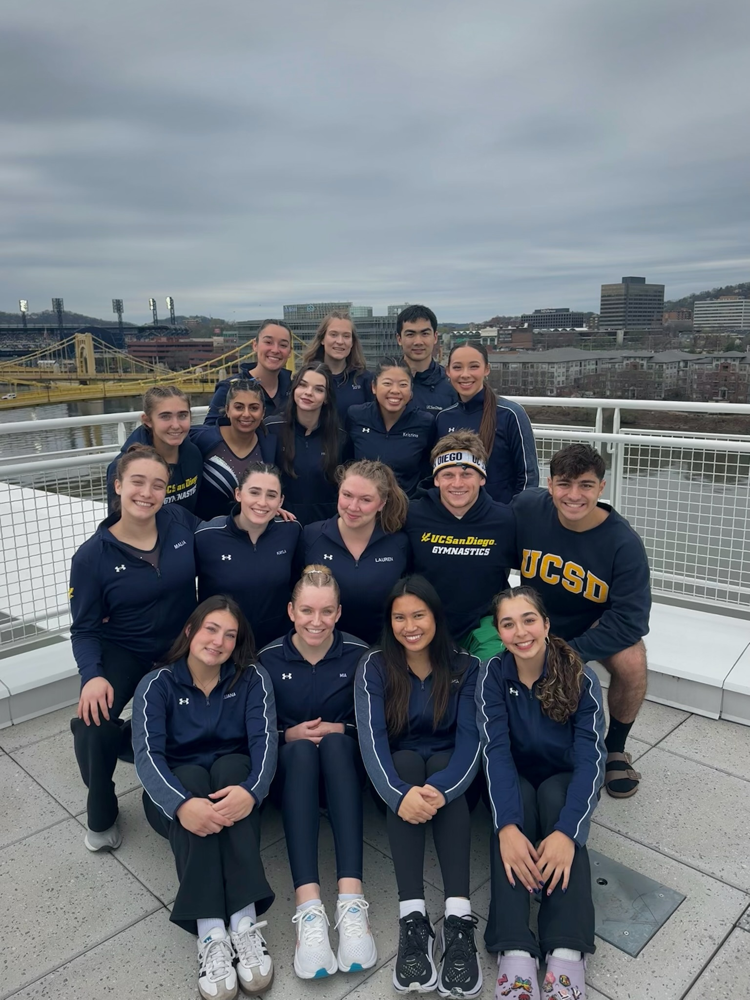
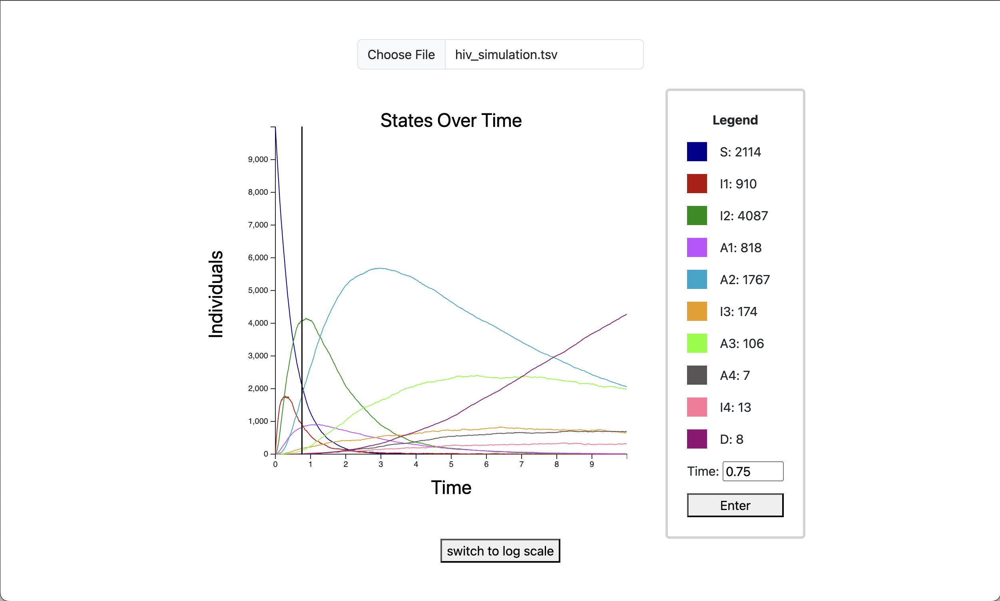

# User Page
## Table of Contents
- [Personal](#personal)
- [Programming](#programming)
- [My Projects](#my-projects)
## Personal
Hi, my name is **Kayla Phillips**! 
I'm a second year Computer Science major at UCSD.
Because life can get stressful, one of my favorite sayings is:
> One day at a time.

In my free time, I <ins>love</ins> to do gymnastics.
I just competed at NAIGC Nationals for the first time!

If anyone is interested in joining UCSD's Club Gymnastics team, visit our [website](https://recreation.ucsd.edu/competitive-sports/gymnastics/).

## Programming
The `programming languages` that I've worked with in the past include:
- Python
- Java
- C++
- ARM Assembly
- JavaScript
- HTML
- CSS
  
My favorite CS classes I've taken at UCSD so far:
1. CSE 100: Advanced Data Structures
2. CSE 12: Basic Data Structures and Object-Oriented Design

This is my [GitHub account](https://github.com/Kayla-Phillips)
## My Projects
- [x] FAVITES-Lite Visualization Tool: 
  - Web app to track data on the number of individuals in each disease state at any given time
  - Used JavaScript and HTML
  - Summarized results in a paper in collaboration with another student about how our projects increased the accessibility of FAVITES-Lite
  - [Paper](https://doi.org/10.1101/2024.06.10.24308702)
  - 
- [x] Blackjack App with Genetic Algorithm
  - Developed a full-stack web application to play Blackjack against the computer 
  - Used a genetic algorithm to create a hint feature which recommends a move to the user based on its training
  - Used Python, JavaScript, HTML, and CSS
  - [Website](https://blackjack-by-grace-and-kayla.onrender.com/)

